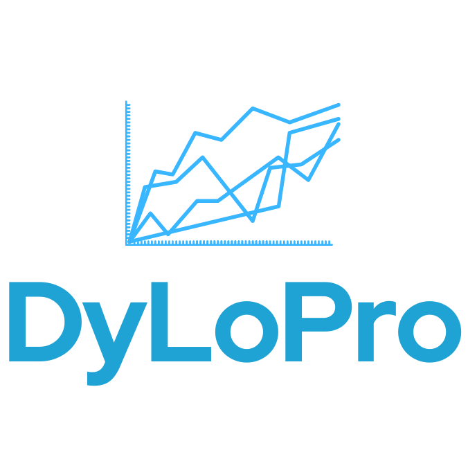

<p align="center">
  
</p>

#

The *DyLoPro Python Library* is a **visual analytics** tool that allows 
**Process Mining (PM)**[^1] practitioners to efficiently and comprehensively 
explore the **dynamics** in **event logs** over time, prior to applying PM 
techniques. These **comprehensive exploration capabilities** are provided 
by extensive set of plotting functionalities, visualizing the 
dynamics over time from different **process perspectives**. 

[^1]: van der Aalst, W. (2016). Data Science in Action. In: Process Mining. Springer, Berlin, Heidelberg. https://doi.org/10.1007/978-3-662-49851-4_1
    
      https://en.wikipedia.org/wiki/Process_mining

> DyLoPro library is ready-to-use and efficient software implementation of the 
> identically named **_DyLoPro framework_**, introduced in the paper 
> ***DyLoPro: Profiling the Dynamics of Event Logs***.
> The paper can be found 
> [here](https://doi.org/10.1007/978-3-031-41620-0_9).

_DyLoPro is a comprehensive visual analytics framework designed to 
explore event log dynamics over time. DyLoPro’s comprehensiveness 
is achieved through the incorporation of the main process 
perspectives - the control-flow, data (including resources) and 
performance, along two orthogonal dimensions of log concepts and 
representation types. It incorporates six log concepts to capture 
all essential information from event logs, including variants and 
directly-follows relations for the control-flow perspective, and 
categorical and numeric case and event features for the data 
perspective. These six log concepts can be represented using 
five representation types, including four performance-oriented 
ones (throughput time, number of events per case, outcome, and 
directly-follows-relations’ performance) and one generic type. 
With this two-dimensional approach, end users can gain a nuanced 
and holistic view of event log dynamics, efficiently identifying 
patterns, temporary or permanent changes, and trends of interest 
from multiple perspectives. Upon identification, they can further 
analyze these patterns and trends, ultimately leading to more 
appropriate application of downstream process mining techniques._


## Documentation
You can consult the documentation of DyLoPro [__here__](https://DyLoPro.readthedocs.io). 

The following terms are used interchangeably throughout the documentation:
- *'case'* and *'trace'*
- *'time period'*, *'time bucket'* and *'time interval'*

## Installation
You can install DyLoPro using:
```bash
pip install DyLoPro
```

The DyLoPro PyPi page can be consulted [here](https://pypi.org/project/DyLoPro/).

## Requirements 
__DyLoPro__ depends on the following Python packages: 
- numpy *(version >=1.21.5)*
- pandas *(version >=2.0.2)*
- matplotlib *(version >=3.7.1)*
- tqdm *(version >=4.63.0)*

If (some of) these requirements are not satisfied yet, then these packages will automatically be installed when [installing __DyLoPro__](#installation).


## Get Started 

### Assumptions & Terminology 

For the moment, DyLoPro assumes flat event logs, and does not cater to object-centric 
event logs. DyLoPro also regards events to be the atomic unit of the event log. 
In other words, the execution of a single event is recorded as a single row in the 
resulting event log. For the terminology and definitions employed by the 
'DyLoPro' Python package, please refer to *Section 3 (Preliminaries)* of the 
[corresponding academic paper](https://github.com/BrechtWts/DyLoPro/blob/master/DyLoPro_Framework_Preprint.pdf).

### Step 1: Initializing a ``DynamicLogPlots`` instance
Assuming that you have already loaded an event log into a pd.DataFrame called 
e.g. ``event_log``.
After having imported the DyLoPro package, a ``DynamicLogPlots`` instance has to 
be initialized. The ``DynamicLogPlots`` class provides one single source of 
access to all of DyLoPro's visualization methods, and thereby serves as the 
interface between the your python environment and DyLoPro’s underlying 
computational logic.

```python
import DyLoPro as dlp
plot_object = dlp.DynamicLogPlots(event_log, 
                                  case_id_key, 
                                  activity_key, 
                                  timestamp_key,
                                  categorical_casefeatures, 
                                  numerical_casefeatures, 
                                  categorical_eventfeatures, 
                                  numerical_eventfeatures, 
                                  start_date, 
                                  end_date, 
                                  outcome)
```

After running this block of code, DyLoPro will verify the validity 
of the event log and all arguments specified. 
- If everything checks out, 
the event log is preprocessed into an internal format that allows DyLoPro to 
efficiently compute and visualize all aggregations on an on-demand basis. 
Afterwards, a ``DynamicLogPlots`` object is initialized, and all 
visualization methods can be accessed by invoking the corresponding methods 
on this instance. 

- If an error is detected, DyLoPro will raise an error with a dedicated error 
message describing what went wrong and how it can be resolved. 

The formatting requirements of the event log, and of all of the arguments 
needed to initialize a ``DynamicLogPlots`` instance (see code block above) 
can be consulted [__here__](https://dylopro.readthedocs.io/en/latest/DyLoPro.html#DyLoPro.DynamicLogPlotting.DynamicLogPlots).

### Step 2: Accessing all visualization methods
Assuming [Step 1](#step-1-initializing-a-dynamiclogplots-instance) is 
successfully completed, you can now easily access all visualization methods 
by simply invoking the appropriate methods on ``plot_object``.

As already mentioned, DyLoPro is the implementation of the identically named 
_DyLoPro framework_. [Below](#framework-to-package-mapping), you will find a 
concise summary of the framework, followed by a comprehensive explanation of 
its implementation as a Python package. This section will guide you through 
leveraging all the available visualization capabilities. For a more 
detailed explanation on the framework, please refer to Section 4 of the 
[*paper*](https://github.com/BrechtWts/DyLoPro/blob/master/DyLoPro_Framework_Preprint.pdf).

Addtionally, the detailed notebooks containing the 
[case studies](#case-studies) conducted on a number of commonly used 
real-life event logs might also improve your understanding on how to 
use and access DyLoPro's variety of plotting methods.

#### Framework to package mapping 
___
DyLoPro provides functionality to construct and visualize time series, i.e. 
the log dynamics, for a variety of **_log concepts_**. For each 
*log concept*, the dynamics can be represented using five different 
**_representation types_**. 

- __log concepts__: the main dimensions along which we capture event log 
dynamics.
- __representation types__: how the event log dynamics should be represented 
and analyzed for each log concept.

##### __Brief Summary Framework__
___
The framework formalizes this procedure in three stages: 

1. __Log Discretization__: Subdividing the event log into a chronologically 
   ordered set of sub-logs. This is done in two consecutive steps:
   1. Given that the log encompasses data spanning a temporal interval 
      denoted as T, split up T in a chronologically ordered set of 
      equal-length time intervals.
   1. Create the ordered set of sub-logs by assigning each case to exactly 
      one of these time intervals. 

1. __Domain Definition__:
   * Defining along which *log concept* to capture 
     log dynamics, and how to represent these dynamics. This boils down to 
     defining the *log concept* and *representation type* respectively.
   * The resulting *log concept - representation type* combination translates 
     into a unique domain-specific mapping function. 

1. __Time Series Construction & Visualization__: 
   * Applying the resulting mapping function to each of the chronologically
     ordered sub-logs. Thereby creating (multiple) time serie(s).
   * Visualizing the constructed time series. 

##### __Framework Implementation DyLoPro Package__
___
As already mentioned, all visualization methods can be accessed by invoking 
the appropriate methods on your initialized ``DynamicLogPlots`` instance. 
All of __DyLoPro__'s plotting methods construct time series by deriving 
real-valued measures for a choronologically ordered set of sublogs. 

The three-stage framework is implemented in this package as follows: 

* Each of the plotting methods that can be invoked, pertains to exactly one 
  **log concept**.
* Given a certain *log concept*, and hence (one of its) associated plotting 
  methods, the **representation type** can be passed on to that method 
  by specifying the ``plt_type`` argument. The five representation types proposed 
  in [the paper](https://github.com/BrechtWts/DyLoPro/blob/master/DyLoPro_Framework_Preprint.pdf) 
  correspond to the followig argument values for the ``plt_type`` parameter.
  1. __Isolated__ : ``plt_type='univariate'``
  1. __Throughput Time (TT)__ : ``plt_type='type_tt'``
  1. __Case Length (NEPC)__ : ``plt_type='type_events_case'``
  1. __Outcome__ : ``plt_type='type_outcome'``
  1. __DFR Performance__ : ``plt_type='type_dfr_performance'``
* __Log Discretization__: Also the *Log Discretization* can be specified as 
  as arguments of each plotting method.
  1. ``frequency`` parameter: Determine the frequency by which the cases 
     are grouped together.
  1. ``case_assignment`` parameter: Determines the condition upon which each 
     case is assigned to a certain time interval.

  E.g. if `frequency='weekly'` and `case_assignment='first_event'`, each case 
  is assigned to the one-week time interval in which its first event occurs 
  and hence each sublog will consist of all cases that were initialized in 
  one particular week. 

  Each method is also equipped with an additional set of optional 
  configuration parameters, providing even more customization options to the 
  user. For more information about the parameters corresponding to these 
  methods, please consult the [documentation](#documentation).


The table underneath lists the plotting methods corresponding to each of 
the *log concepts* proposed in the *DyLoPro framework*. You can directly 
navigate to the detailled documentation of each methodd by clicking on it. 

|    | Log Concept   | Method 1      | Method 2  |
| ---| :-----------: |:-------------:| :-------: |
|  1 | Variants      | [``topK_variants_evol()``](https://dylopro.readthedocs.io/en/latest/DyLoPro.html#DyLoPro.DynamicLogPlotting.DynamicLogPlots.topK_variants_evol) | [``variants_evol()``](https://dylopro.readthedocs.io/en/latest/DyLoPro.html#DyLoPro.DynamicLogPlotting.DynamicLogPlots.variants_evol) |
|  2 | Directly-Follows Relations      | [``topK_dfr_evol()``](https://dylopro.readthedocs.io/en/latest/DyLoPro.html#DyLoPro.DynamicLogPlotting.DynamicLogPlots.topK_dfr_evol)      |  [``dfr_evol()``](https://dylopro.readthedocs.io/en/latest/DyLoPro.html#DyLoPro.DynamicLogPlotting.DynamicLogPlots.dfr_evol) |
|  3 | Categorical Case Feature | [``topK_categorical_caseftr_evol()``](https://dylopro.readthedocs.io/en/latest/DyLoPro.html#DyLoPro.DynamicLogPlotting.DynamicLogPlots.topK_categorical_caseftr_evol)      |    / |
|  4 | Numerical Case Features | [``num_casefts_evol()``](https://dylopro.readthedocs.io/en/latest/DyLoPro.html#DyLoPro.DynamicLogPlotting.DynamicLogPlots.num_casefts_evol)      |    / |
|  5 | Categorical Event Feature | [``topK_categorical_eventftr_evol()``](https://dylopro.readthedocs.io/en/latest/DyLoPro.html#DyLoPro.DynamicLogPlotting.DynamicLogPlots.topK_categorical_eventftr_evol)      |    / |
|  6 | Numerical Event Features | [``num_eventfts_evol()``](https://dylopro.readthedocs.io/en/latest/DyLoPro.html#DyLoPro.DynamicLogPlotting.DynamicLogPlots.num_eventfts_evol)      |    / |

Finally, it is also well-worth mentioning that the extensive capabilities 
proposed in the the *DyLoPro framework* are not meant to be exhaustive. 
The visualization methods offered by the **DyLoPro package** are 
consequently meant to be continuously extended and improved. Please find 
the visualization methods extending the framework listed below:

- [``distinct_variants_evol()``](https://dylopro.readthedocs.io/en/latest/DyLoPro.html#DyLoPro.DynamicLogPlotting.DynamicLogPlots.distinct_variants_evol) : __NOTE__: Deprecated. Will be removed in 
  future versions. Use the [``distinct_variants_AdvancedEvol()``](https://dylopro.readthedocs.io/en/latest/DyLoPro.html#DyLoPro.DynamicLogPlotting.DynamicLogPlots.distinct_variants_AdvancedEvol) instead. 
- [``distinct_variants_AdvancedEvol()``](https://dylopro.readthedocs.io/en/latest/DyLoPro.html#DyLoPro.DynamicLogPlotting.DynamicLogPlots.distinct_variants_AdvancedEvol)

## Citing DyLoPro
A Demo paper presenting the DyLoPro package is currently in the making. 

The DyLoPro package is the software implementation of the identically named 
_DyLoPro framework_ proposed in the paper 
***DyLoPro: Profiling the Dynamics of Event Logs***. 

If you are using __DyLoPro__ in your scientific work, please 
cite __DyLoPro__ as follows:

> *Wuyts, B., Weytjens, H., vanden Broucke, S., De Weerdt, J. (2023). DyLoPro: Profiling the Dynamics of Event Logs. In: Di Francescomarino, C., Burattin, A., Janiesch, C., Sadiq, S. (eds) Business Process Management. BPM 2023. Lecture Notes in Computer Science, vol 14159. Springer, Cham. https://doi.org/10.1007/978-3-031-41620-0_9*

The full paper can be found [here](https://doi.org/10.1007/978-3-031-41620-0_9).

## Case Studies
The DyLoPro package has already been used to conduct an extensive analysis 
of the dynamics present in a number of commonly used real-life event logs. 

These case studies, conducted for the 
[BPM paper](https://github.com/BrechtWts/DyLoPro/blob/master/DyLoPro_Framework_Preprint.pdf), 
can be found [here](https://github.com/BrechtWts/DyLoPro_CaseStudies).

## Contributing 
Contributions are welcome, and they are greatly appreciated! Every little bit
helps, and credit will always be given.

You can contribute in many ways. For more information, please refer to the *CONTRIBUTING.md* file. 

## Release Notes
Please consult HISTORY.md for the release notes. 

## License
Free software: GNU General Public License v3


## Credits 

This package was created with Cookiecutter and the `audreyr/cookiecutter-pypackage` project template.
- Cookiecutter: https://github.com/audreyr/cookiecutter
- `audreyr/cookiecutter-pypackage`: https://github.com/audreyr/cookiecutter-pypackage
